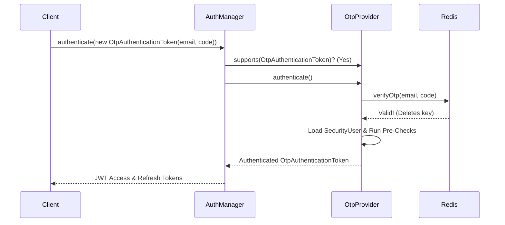

# OTP Passwordless Authentication

This document outlines the architecture and flow of the OTP (One-Time Password) / Magic Code authentication system implemented in `karar.dev`.

---

## 📖 Overview & Example

**What is it?** 
OTP allows users to log into the application without needing to remember a password. Instead, they receive a short-lived "magic code" directly to their email.

**Example Flow:**
1. A user enters their email address on the login page and clicks "Send Magic Code".
2. The backend generates a 6-digit code (e.g., `526 057`), saves it in Redis with a 5-minute TTL, and fires an asynchronous Kafka event.
3. The user receives a beautifully formatted email with their code.
4. The user types `526 057` into the UI and clicks "Verify & Sign in".
5. The backend validates the code, destroys it in Redis, and issues standard JWT tokens. 

---

## 🏛️ Architecture & Implementation

Our OTP implementation integrates deeply with Spring Security's native Provider architecture, ensuring it shares the same robust pre-authentication checks and JWT generation as the standard password login.

Here is how the architecture is constructed, starting from the core `AuthenticationManager`.

### 1. `AuthenticationManager` & `ProviderManager`
The `AuthenticationManager` is the central interface for authentication in Spring Security. In our `ProjectDevSecurityConfig`, we configured a `ProviderManager` to hold a **list of providers**:
```java
ProviderManager providerManager = new ProviderManager(
        List.of(passwordProvider, otpProvider)
);
```
When an authentication request comes in, the manager iterates through these providers. It asks each provider: *"Do you support this specific type of Authentication Token?"*

### 2. `OtpAuthenticationToken`
To route the request to the correct provider, we created a custom `AbstractAuthenticationToken` called `OtpAuthenticationToken`. 
* **Unauthenticated State:** Holds the `email` as the principal and the `otpCode` as the credentials.
* **Authenticated State:** Holds the fully loaded `SecurityUser` as the principal and sets credentials to `null` (for security).

### 3. `OtpAuthenticationProvider`
This is the heart of the OTP logic. When `AuthService.loginWithOtp()` passes an `OtpAuthenticationToken` to the `AuthenticationManager`, the manager routes it specifically to the `OtpAuthenticationProvider`.

**Responsibilities of the Provider:**
1. Cast the token to `OtpAuthenticationToken` and extract the `email` and `otpCode`.
2. Call `OtpTokenService.verifyOtp(email, code)`. If it fails or expires, an `INVALID_OTP` exception is thrown.
3. Load the user details from the database using our existing `CustomUserDetailsService`.
4. Run standard account checks using `CustomPreAuthenticationChecks` (ensuring the user is not locked, disabled, or expired).
5. Return a fully trusted, authenticated `OtpAuthenticationToken`.

### 4. `OtpTokenService` (Redis)
This service handles the lifecycle of the actual codes. 
* It uses `SecureRandom` to generate cryptographically safe 6-digit codes.
* It leverages `StringRedisTemplate` to store the code as `otp:<email>` with a strict 5-minute Time-To-Live (TTL).
* **Single-Use Guarantee:** Upon successful verification, the code is immediately deleted from Redis using `redisTemplate.delete()`.

### 5. Async Email Pipeline (Kafka)
To ensure the `/auth/otp/send` API endpoint remains blazing fast, email delivery is completely decoupled:
1. `AuthService` publishes an `OtpEmailEvent` to the `otp-email` Kafka topic.
2. `OtpEmailConsumer` picks up the event asynchronously.
3. `OtpEmailDispatcher` builds a dynamic `NotificationMessage` pointing to the `otp-email.html` Thymeleaf template.
4. `EmailNotificationSender` renders the HTML and dispatches the email via SMTP.

---

## 🔄 Sequence Diagram


